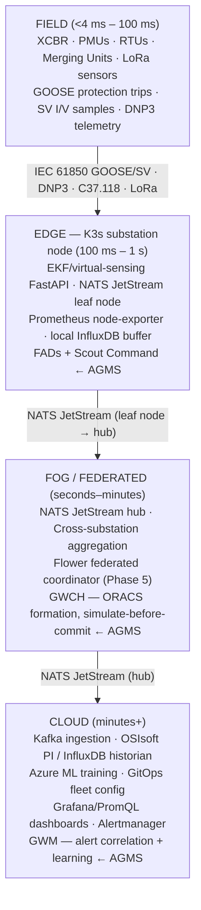

# STK-05: Four-Tier Reference Architecture (Field → Edge → Fog/Federated → Cloud)

**For:** Whiteboard rehearsal — practice drawing the ASCII diagram from memory, then narrate it aloud.
**Purpose:** Draw and narrate the four-tier reference architecture with control-latency tiers and key
components per layer — satisfying success criterion 5. Land the AGMS overlay as a differentiation move
that ties your architecture fluency to the director's own patented work.

---

> **Depth strategy:** FULL/worked depth for all four tiers, both diagram formats, the numbered
> narration script, and the AGMS overlay. The **fog/federated** tier is NAMED here; algorithm depth
> (FedAvg/Flower) is Phase 5. Do NOT add an aggregate vocabulary-bridge table — that is Phase 6.

---

## 1. ASCII Diagram — The Whiteboard Target

**Draw this from memory. Practice until you can sketch it in under 90 seconds.**

```
┌─────────────────────────────────────────────────────────────────┐
│  CLOUD (minutes+)                                               │
│  Kafka · OSIsoft PI · Azure ML · GitOps · Grafana/PromQL        │
│  GWM (alert correlation, learning) ← AGMS                       │
└──────────────────────────┬──────────────────────────────────────┘
                           │ NATS JetStream (hub)
┌──────────────────────────▼──────────────────────────────────────┐
│  FOG / FEDERATED (seconds–minutes)                              │
│  Cross-substation aggregation · Flower (Phase 5)                │
│  GWCH (ORACS formation, simulate-before-commit) ← AGMS          │
└──────────────────────────┬──────────────────────────────────────┘
                           │ NATS JetStream (leaf node)
┌──────────────────────────▼──────────────────────────────────────┐
│  EDGE — K3s substation node (100 ms – 1 s)                      │
│  EKF/virtual-sensing · NATS JetStream · Prometheus scraper      │
│  FADs + Scout Command (island-capable) ← AGMS                   │
└──────────────────────────┬──────────────────────────────────────┘
                           │ IEC 61850 GOOSE/SV · DNP3 · C37.118 · LoRa
┌──────────────────────────▼──────────────────────────────────────┐
│  FIELD (<4 ms – 100 ms)                                         │
│  XCBR · PMUs · RTUs · Merging Units · LoRa sensors              │
│  GOOSE: protection trips · SV: I/V samples · DNP3: telemetry    │
└─────────────────────────────────────────────────────────────────┘
```

**IntelliGrid note:** The 2002 EPRI IntelliGrid/IECSA architecture (docs/intelligrid.pdf) called
these communication zones "**IECSA Environments**" — groupings of common communication requirements
— with three primary domains: Wide Area Measurement and Control, Advanced Distribution Automation,
and Customer Interface. The four-tier field/edge/fog/cloud model is the current modernized framing
of the same layering principle; the IECSA vocabulary is the historical foundation.

---

## 2. Mermaid Diagram — Polished On-Screen Reference



---

## 3. The Four Tiers in Detail

> **Important terminology guard (Pitfall 6):** This four-tier architecture (field / edge /
> fog / cloud) is **NOT** the IEC 61850 three-tier hierarchy (process / bay / station). The IEC
> 61850 hierarchy describes the **substation itself**; this four-tier model describes the **broader
> system** from sensors to cloud. The field tier maps roughly to IEC 61850's process + bay levels
> combined. When you draw this, say which hierarchy you mean.

### Tier 1 — FIELD

| Attribute | Detail |
|-----------|--------|
| **Latency band** | **<4 ms** (GOOSE protection) to **~100 ms** (DNP3 unsolicited reporting) |
| **Protocols** | IEC 61850 GOOSE + SV, DNP3, IEEE C37.118, LoRa, Modbus |
| **Hardware** | Circuit breakers (XCBR), merging units, PMUs (30–120 fps GPS-synced), RTUs, LoRa sensors |
| **Control** | Hardwired protection relays + GOOSE — **no software round-trip**; protection acts within the substation LAN |
| **Key property** | GOOSE and SV are Layer 2 Ethernet — they **never leave the substation LAN** and cannot be routed |

**What to say aloud:** "Circuit breakers modeled as XCBR, PMUs delivering GPS-synced phasors at 30–120 frames per second, LoRa sensors on battery for kilometer-range monitoring. Protection happens here in under 4 milliseconds via IEC 61850 GOOSE — no software, no round-trip."

### Tier 2 — EDGE (K3s Substation Node)

| Attribute | Detail |
|-----------|--------|
| **Latency band** | **100 ms – 1 s** sub-second inference |
| **Stack** | K3s, NATS JetStream leaf node, EKF/virtual-sensing FastAPI service, Prometheus node-exporter, local InfluxDB buffer (island-mode) |
| **Functions** | EKF state estimation, virtual temperature sensing, local reactive-power compensation; NATS pub/sub to fog/cloud; local Prometheus scraping |
| **Control** | **Operates autonomously without WAN** (island mode via K3s + local JetStream buffer) |
| **Key property** | This is the tier where real-time inference happens without cloud round-trip |

**Juan's stack here:** This tier IS Juan's production stack, peer-to-peer-upgraded. Full Kubernetes → K3s. MQTT → NATS JetStream. InfluxDB+Grafana → Prometheus. The EKF engine is the Phase-1 virtual-sensing demo.

**What to say aloud:** "One level up, the edge tier is a K3s substation node. It runs the EKF virtual-sensing inference — estimating unmeasured quantities like line temperature or hot-spot — at sub-second latency. NATS JetStream leaf node handles local pub/sub and buffers messages for cloud replay if WAN drops — island mode."

### Tier 3 — FOG / FEDERATED (Cross-Substation Aggregation)

| Attribute | Detail |
|-----------|--------|
| **Latency band** | **Seconds to minutes** |
| **Stack** | NATS JetStream hub, federated learning coordinator (Flower — Phase 5 depth), cross-substation state aggregation service |
| **Functions** | Aggregate EKF outputs from multiple edge nodes; federated model weight exchange (Phase 5 scope); cross-substation voltage profile |
| **Control** | Cross-substation decisions; seconds–minutes decisions that need more than one substation's data |
| **Key property** | This is where decentralized coordination happens — **Phase 5 (FED-01/FED-02) owns the algorithm depth**; this tier is named here at awareness level |

**What to say aloud:** "The fog tier aggregates outputs from multiple edge nodes — cross-substation state estimates, voting on anomalies. This is where federated coordination happens. Phase 5 owns the algorithm depth, but the tier exists for the seconds-to-minutes decisions that need more than one substation's data."

### Tier 4 — CLOUD (Historian, Training, GitOps)

| Attribute | Detail |
|-----------|--------|
| **Latency band** | **Minutes to hours** |
| **Stack** | Kafka (event ingestion), OSIsoft PI / InfluxDB historian, ML training pipeline (Azure ML), GitOps (fleet config push to K3s nodes), Grafana dashboards (PromQL), Alertmanager routing |
| **Functions** | Long-term data retention; model training and versioning; fleet configuration push (GitOps to K3s nodes); executive dashboards; alert routing |
| **Control** | **Non-real-time only — no protective control from this tier** |
| **Key property** | Kafka at the cloud tier only — never at edge ("Kafka is a semi-truck; NATS is a bicycle for the substation closet") |

**What to say aloud:** "At the top, the cloud is Kafka for ingestion, OSIsoft PI or InfluxDB for long-term history, Azure ML for model training, GitOps for pushing config down to the K3s fleet, and Grafana/PromQL for fleet dashboards and alerting. No protective control from here — only minutes-or-longer decisions."

---

## 4. Numbered Narration Script

**Practice saying this aloud, bottom to top, in under 3 minutes. This is the "narrate it" half of criterion 5.**

**1. Field tier (start here):**
> "At the bottom, the field tier — circuit breakers modeled as XCBR, PMUs delivering GPS-synced
> phasors at 30–120 frames per second, LoRa sensors on battery for kilometer-range monitoring.
> Protection happens here, in under 4 milliseconds via IEC 61850 GOOSE — no software, no round-trip.
> GOOSE and SV are Layer 2 — they never leave the substation LAN."

**2. Edge tier (K3s substation node):**
> "One level up, the edge tier is a K3s substation node. It runs the EKF virtual-sensing inference
> — estimating unmeasured quantities like line temperature or hot-spot — at sub-second latency.
> NATS JetStream leaf node handles local pub/sub and buffers messages for cloud replay if WAN drops
> — that is island mode. The node operates autonomously without WAN connectivity."

**3. Fog/federated tier:**
> "The fog tier aggregates outputs from multiple edge nodes — cross-substation state estimates,
> voting on anomalies. This is where federated coordination happens — Phase 5 owns the algorithm
> depth, but the tier exists for the seconds-to-minutes decisions that need more than one
> substation's data."

**4. Cloud tier:**
> "At the top, the cloud is Kafka for ingestion, OSIsoft PI or InfluxDB for long-term history,
> Azure ML for model training, GitOps for pushing config down to the K3s fleet, and
> Grafana/PromQL for fleet dashboards and alerting. No protective control from here — only
> minutes-or-longer decisions."

**5. AGMS overlay (the power move — say this last):**
> "If I overlay the director's patent family on this architecture: the Field Agent Devices running
> scouts land at the edge tier; Scout Command is the K3s pod scheduler with grid semantics;
> Operation Loop simulate-before-commit is the fog tier's orchestration gate — and that is in the
> *allowed claims* of the granted patent, US 12,596,341 B2, assigned to GE Vernova itself;
> GridWideMind is the cloud learning engine."

---

## 5. AGMS Overlay — The Director's Patent Family on the Four Tiers

The director's Adaptive Grid Management System (AGMS) patent family maps cleanly onto this four-tier
architecture. See `.planning/research/patents/INDEX.md` for full component depth — this overlay
names the connection; it does not re-derive it.

| AGMS Patent Component | Maps to Tier | Rationale |
|-----------------------|-------------|-----------|
| **Field Agent Devices (FADs) running scouts** | Tier 2 — Edge | FADs are the K3s nodes running role-typed scout applications (Coordinator, Messenger, Inspector, Guard) |
| **Scout Command (1441 → 1447)** | Tier 2 — Edge (deployment) | Scout incubation and launch onto FADs is the K3s pod scheduling analog with grid semantics |
| **ORACS operating cells (island mode)** | Tier 2 — Edge | Operating cells are self-forming and WAN-optional — identical to K3s + local JetStream island operation |
| **Operation Loop Formation simulate-before-commit** | Tier 3 — Fog | The CVXPY MPC analog: "simulate before committing" runs at the orchestration layer, not on individual FADs; in the *allowed claims* of US 12,596,341 B2 (granted, GE Vernova) |
| **GridWideCommandHub (GWCH) federation** | Tier 3 — Fog | Cross-substation federation command; the fog/federated tier is where ORACS formation is orchestrated |
| **GridWideMind (GWM) alert correlation + learning engine** | Tier 4 — Cloud | Long-horizon learning, alert correlation across the fleet, simulation engine |

**Cross-reference:** `.planning/research/patents/INDEX.md` — full AGMS component map, formation pipeline, and Juan-to-AGMS bridge table.

**Interview one-liner:** "The patent family is a blueprint I have been building the components of — independently, in buildings and DER — with the same architectural DNA: edge runtime for scouts, pod scheduler as the Scout Incubator, CVXPY MPC as the simulate-before-commit gate."

---

## <3-min say-aloud version

> "Four tiers, bottom to top. Field tier: XCBR circuit breakers, PMUs at 30–120 frames per second,
> LoRa sensors. Protection here is IEC 61850 GOOSE, under 4 milliseconds, Layer 2, no round-trip.
> Edge tier: K3s substation node running EKF virtual-sensing inference at sub-second latency, NATS
> JetStream leaf node for pub/sub, local buffer so it keeps running if WAN drops — island mode.
> Fog tier: NATS hub aggregating outputs across substations, seconds to minutes, federated
> coordination — Phase 5 owns the algorithm depth. Cloud tier: Kafka for ingestion, OSIsoft PI or
> InfluxDB for history, Azure ML for model training, GitOps pushing config back to K3s, Grafana and
> Alertmanager for fleet visibility. No protective control from cloud — minutes-plus only.
> Now the AGMS overlay: Field Agent Devices running scouts land at the edge tier; Scout Command is
> the K3s pod scheduler with grid semantics; Operation Loop simulate-before-commit is the fog
> orchestration gate — that is in the granted GE Vernova patent's claims; GridWideMind is the cloud
> learning engine."

---

## → Bridge to your work

> **"The edge tier in this diagram IS my production stack, peer-for-peer upgraded to the edge-optimized
> versions. The architecture is not theoretical for me — I have run every component in it, just named
> slightly differently."**

| Four-Tier Component | Juan's Production Analog (CV) |
|---------------------|-------------------------------|
| K3s (edge orchestration) | Full Kubernetes — same API, 4x lighter for substation closet |
| NATS JetStream (leaf node pub/sub + durable replay) | MQTT + Mosquitto — same pub/sub instinct, add durable replay + decentralized JWT + leaf-node topology |
| EKF/virtual-sensing FastAPI service | Phase-1 EKF demo (`ekf_line_temp_demo.py`) + OSED FastAPI control plane |
| Prometheus node-exporter (pull scraping) | InfluxDB push model — Prometheus adds native K8s service discovery and native alerting |
| Local InfluxDB buffer (island mode) | OSED local buffering (InfluxDB/TimescaleDB) sustaining control loop during WAN outage |
| Kafka at cloud tier | Never used Kafka; understand why it belongs at cloud-only (JVM + 64–128 GB RAM) |
| AGMS Scout incubation (K3s pod scheduling) | OSED FastAPI resolves abstract jobs into placed, health-checked K3s workloads |
| Operation Loop simulate-before-commit | CVXPY MPC solve-before-commit pattern in HEMS/DER work |

**How to say this in the interview:**

> "The edge tier is exactly what I built in OSED — full Kubernetes goes to K3s, MQTT goes to
> NATS JetStream for durable replay and island mode, InfluxDB push goes to Prometheus pull for
> native K8s observability. The EKF engine is the virtual-sensing demo I built in Phase 1. So
> when you ask me to deploy virtual sensing at the substation edge, I am not designing from scratch
> — I am swapping each component for its edge-optimized peer in a stack I have already run in
> production. And the AGMS overlay maps directly onto that stack: I have built the Scout Incubator
> pattern as a K3s scheduler and the simulate-before-commit gate as CVXPY MPC."

---

## Quick-Recall Card (Recite Before the Interview)

1. **Tier 1 — FIELD** (<4 ms GOOSE to ~100 ms DNP3): XCBR, PMUs, RTUs, LoRa sensors; IEC 61850 GOOSE/SV + DNP3 + C37.118 + LoRa; hardwired protection, no software round-trip; GOOSE and SV are Layer 2 — never leave substation LAN.
2. **Tier 2 — EDGE** (100 ms – 1 s): K3s substation node, NATS JetStream leaf node, EKF/virtual-sensing FastAPI, Prometheus node-exporter, local InfluxDB buffer; island-mode WAN-optional operation; this is Juan's production stack.
3. **Tier 3 — FOG/FEDERATED** (seconds–minutes): NATS JetStream hub, cross-substation EKF aggregation, Flower coordinator (Phase 5); seconds-to-minutes decisions requiring multiple substations' data.
4. **Tier 4 — CLOUD** (minutes+): Kafka ingestion, OSIsoft PI / InfluxDB historian, Azure ML training, GitOps fleet config, Grafana/PromQL, Alertmanager; no protective control from here.
5. **AGMS overlay:** FADs + Scout Command → Edge (Tier 2); GWCH + Operation Loop simulate-before-commit → Fog (Tier 3); GWM alert correlation + learning → Cloud (Tier 4). Cross-link: `.planning/research/patents/INDEX.md`.
6. **The IEC 61850 / four-tier distinction:** IEC 61850 has its own three-tier model (process / bay / station) inside the substation. This four-tier model is the broader system. Field tier ≈ IEC 61850 process + bay combined.
7. **Inter-tier transport:** NATS JetStream connects edge → fog → cloud; IEC 61850 GOOSE/SV + DNP3 + C37.118 + LoRa connect field into edge.
8. **My bridge:** Edge tier = OSED stack (K8s→K3s, MQTT→NATS, InfluxDB→Prometheus, CVXPY MPC = simulate-before-commit). Architecture is not theoretical — I have run every layer of it.

---

*Sources: 04-RESEARCH.md §"Four-Tier Architecture Design" (primary spine — all tier content, AGMS overlay table, ASCII diagram, narration script elements); docs/intelligrid.pdf pages 1–20 (IECSA/IntelliGrid reference — scan confirmed no tier-naming conflict; "IECSA Environments" framing noted); IEC TR 61850-10-3:2022 docs/IEC 61850-3.pdf (process/bay/station three-tier model, GOOSE/SV/MMS services); .planning/research/patents/INDEX.md (AGMS component map, formation pipeline, Juan-to-AGMS bridge table — Phase 3); docs/Juan Carlos Oviedo Cepeda - 2026.pdf (OSED, K8s/MQTT/InfluxDB/CVXPY production experience — the bridge anchors).*
